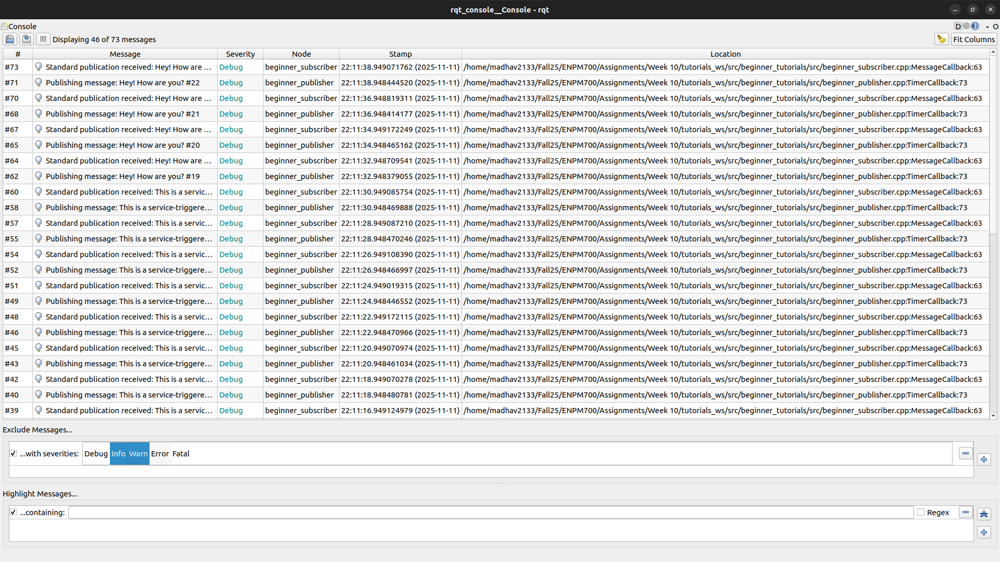
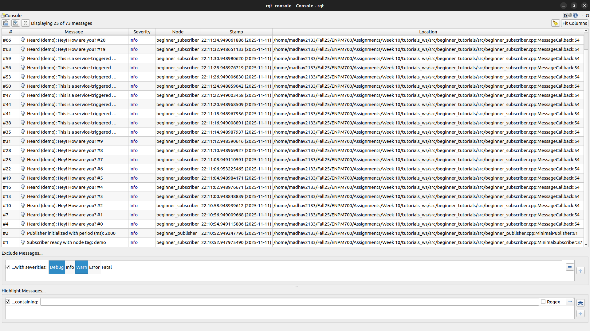
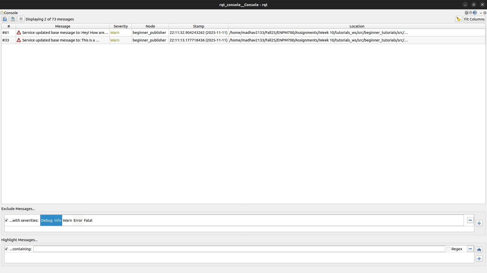

# ROS 2 Services, Logging, and Launch files - Programming Assignment 2

## Author

Venkata Madhav Tadavarthi (121058768)

## Overview
- `beginner_publisher`: publishes a custom string message (configured in `src/beginner_publisher.cpp`)
- `beginner_subscriber`: listens to the same topic and logs received strings
- Both nodes expose a `toggle_message` service, parameters, and use `_STREAM` logging at all levels
- Launch file (`launch/pub_sub_launch.py`) starts both nodes with configurable publish period, subscriber tag, and debug logging

## Project Structure

```
beginner_tutorials/
├── launch/
│   └── pub_sub_launch.py
├── screenshots/
│   ├── DEBUG_console.png
│   ├── INFO_console.png
│   └── WARN_console.png
└── src/
    ├── beginner_publisher.cpp
    └── beginner_subscriber.cpp
```

## Assumptions & Dependencies
- ROS 2 Humble Hawksbill (desktop install)
- `colcon` build tool (included in ROS desktop variants)
- C++17-capable compiler (GCC 11+ on Ubuntu 22.04)
- Workspace sourced in a POSIX-compliant shell (`bash`, `zsh`, etc.)

## Setup (Build & Run)
1. Create (or reuse) a colcon workspace and clone this package:
   ```bash
   mkdir -p ~/tutorials_ws/src
   cd ~/tutorials_ws/src
   git clone https://github.com/Madhav2133/my_begineer_tutorails.git
   cd ~/tutorials_ws
   ```
2. Source ROS 2:
   ```bash
   source /opt/ros/humble/setup.bash
   ```
3. Build the workspace:
   ```bash
   colcon build
   ```
4. Overlay the workspace:
   ```bash
   source install/setup.bash
   ```

## Running the Nodes

- Launch both nodes with customizable period, subscriber tag, and debug logging:
  ```bash
  ros2 launch beginner_tutorials pub_sub_launch.py publish_period_ms:=1000 subscriber_tag:=demo
  ```
  - I like to put 1000ms as its slow and easy to visualise whats happening

- Exercise the `toggle_message` service in another terminal:
  ```bash
  ros2 service call /toggle_message example_interfaces/srv/SetBool "{data: true}"
  ```
- To revert back to the original message:
  ```bash
  ros2 service call /toggle_message example_interfaces/srv/SetBool "{data: false}"
  ```

## RQT Console

Captured example filter/log views while adjusting the logger level:





## Sample Outputs

```
$ ros2 launch beginner_tutorials pub_sub_launch.py publish_period_ms:=250 subscriber_tag:=console_demo
ros2 launch beginner_tutorials pub_sub_launch.py publish_period_ms:=2000 subscriber_tag:=demo
[INFO] [launch]: All log files can be found below /home/madhav2133/.ros/log/2025-11-11-22-19-06-086756-madhav2133-Lenovo-Legion-5-15IMH05-7854
[INFO] [launch]: Default logging verbosity is set to INFO
[INFO] [beginner_publisher-1]: process started with pid [7855]
[INFO] [beginner_subscriber-2]: process started with pid [7857]
...
------ BUNCH OF DEBUG INFORMATION -----
...
[beginner_publisher-1] [DEBUG] [1762917548.199829916] [rcl]: Calling timer
[beginner_publisher-1] [DEBUG] [1762917548.199947576] [beginner_publisher]: Publishing message: Hey! How are you? #0
[beginner_subscriber-2] [DEBUG] [1762917548.200320195] [rcl]: Subscription taking message
[beginner_subscriber-2] [DEBUG] [1762917548.200425116] [rcl]: Subscription take succeeded: true
[beginner_subscriber-2] [INFO] [1762917548.200475998] [beginner_subscriber]: Heard (demo): Hey! How are you? #0
[beginner_subscriber-2] [DEBUG] [1762917548.200602634] [beginner_subscriber]: Standard publication received: Hey! How are you? #0
[beginner_publisher-1] [DEBUG] [1762917550.199861488] [rcl]: Calling timer
[beginner_publisher-1] [DEBUG] [1762917550.199976599] [beginner_publisher]: Publishing message: Hey! How are you? #1
[beginner_subscriber-2] [DEBUG] [1762917550.200346331] [rcl]: Subscription taking message
[beginner_subscriber-2] [DEBUG] [1762917550.200427160] [rcl]: Subscription take succeeded: true
[beginner_subscriber-2] [INFO] [1762917550.200475067] [beginner_subscriber]: Heard (demo): Hey! How are you? #1
[beginner_subscriber-2] [DEBUG] [1762917550.200598868] [beginner_subscriber]: Standard publication received: Hey! How are you? #1
```

When the service client is called:

```
[beginner_publisher-1] [DEBUG] [1762917722.405757044] [rcl]: Service server taking service request
[beginner_publisher-1] [DEBUG] [1762917722.405847164] [rcl]: Service take request succeeded: true
[beginner_publisher-1] [WARN] [1762917722.405877599] [beginner_publisher]: Service updated base message to: This is a service-triggered message 
[beginner_publisher-1] [DEBUG] [1762917722.405904115] [rcl]: Sending service response
[beginner_publisher-1] [DEBUG] [1762917723.818444599] [rcl]: Calling timer
[beginner_publisher-1] [DEBUG] [1762917723.818530748] [beginner_publisher]: Publishing message: This is a service-triggered message  #3
[beginner_subscriber-2] [DEBUG] [1762917723.818955264] [rcl]: Subscription taking message
[beginner_subscriber-2] [DEBUG] [1762917723.819026638] [rcl]: Subscription take succeeded: true
[beginner_subscriber-2] [INFO] [1762917723.819067499] [beginner_subscriber]: Heard (demo): This is a service-triggered message  #3
[beginner_subscriber-2] [DEBUG] [1762917723.819122672] [beginner_subscriber]: Standard publication received: This is a service-triggered message  #3
[beginner_publisher-1] [DEBUG] [1762917725.818480069] [rcl]: Calling timer
[beginner_publisher-1] [DEBUG] [1762917725.818570113] [beginner_publisher]: Publishing message: This is a service-triggered message  #4
[beginner_subscriber-2] [DEBUG] [1762917725.818945551] [rcl]: Subscription taking message
[beginner_subscriber-2] [DEBUG] [1762917725.819012980] [rcl]: Subscription take succeeded: true
[beginner_subscriber-2] [INFO] [1762917725.819053589] [beginner_subscriber]: Heard (demo): This is a service-triggered message  #4
[beginner_subscriber-2] [DEBUG] [1762917725.819104623] [beginner_subscriber]: Standard publication received: This is a service-triggered message  #4
```


```
$ ros2 topic list
/beginner_publisher
/parameter_events
/rosout
```

```
$ros2 service list
/beginner_publisher/describe_parameters
/beginner_publisher/get_parameter_types
/beginner_publisher/get_parameters
/beginner_publisher/list_parameters
/beginner_publisher/set_parameters
/beginner_publisher/set_parameters_atomically
/beginner_subscriber/describe_parameters
/beginner_subscriber/get_parameter_types
/beginner_subscriber/get_parameters
/beginner_subscriber/list_parameters
/beginner_subscriber/set_parameters
/beginner_subscriber/set_parameters_atomically
/toggle_message
```

```
$ ros2 service call /toggle_message example_interfaces/srv/SetBool "{data: true}"
requester: making request: example_interfaces.srv.SetBool_Request(data=True)

response:
example_interfaces.srv.SetBool_Response(success=True, message='Base message set to service-triggered message.')
```