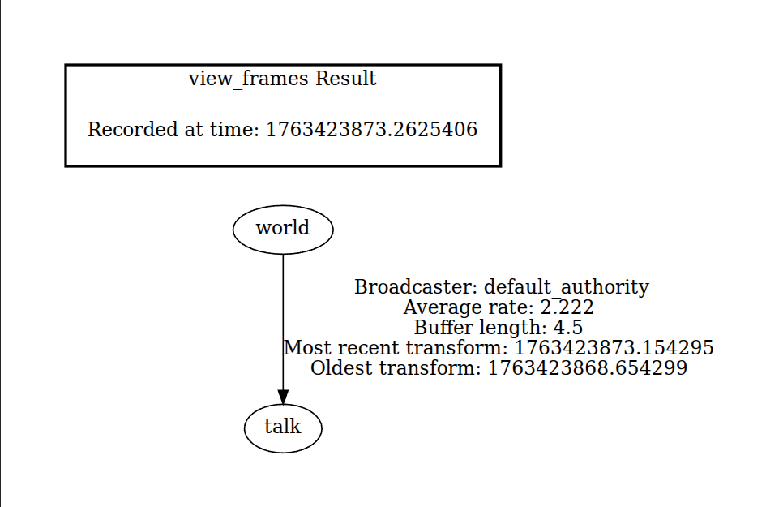

# ROS 2 Services, Logging, and Launch files - Programming Assignment 2

## Author

Venkata Madhav Tadavarthi (121058768)

## Overview
- `beginner_publisher`: publishes a custom string message (configured in `src/beginner_publisher.cpp`)
- `beginner_subscriber`: listens to the same topic and logs received strings
- Both nodes expose a `toggle_message` service, parameters, and use `_STREAM` logging at all levels
- Launch file (`launch/pub_sub_launch.py`) starts both nodes with configurable publish period, subscriber tag, and debug logging
- TF frame broadcasting: The publisher node broadcasts a `/talk` frame with parent `/world` with time-variant transforms
- Integration tests: Catch2-based Level 2 integration tests for the publisher node
- Bag recording: Launch file for recording ROS 2 bags with the publisher node

## Project Structure

```
beginner_tutorials/
├── launch/
│   ├── pub_sub_launch.py
│   ├── record_bag.launch.py
│   └── test_publisher.launch.py
├── screenshots/
│   ├── DEBUG_console.png
│   ├── INFO_console.png
│   └── WARN_console.png
├── results/
│   ├── bags/
│   │   └── publisher_recording/
│   └── frames.pdf
├── test/
│   └── test_beginner_publisher.cpp
└── src/
    ├── beginner_publisher.cpp
    └── beginner_subscriber.cpp
```

## Assumptions & Dependencies
- **ROS 2 Humble Hawksbill** (desktop install)
- `colcon` build tool (included in ROS desktop variants)
- C++17-capable compiler (GCC 11+ on Ubuntu 22.04)
- Workspace sourced in a POSIX-compliant shell (`bash`, `zsh`, etc.)
- **TF2 packages**: `ros-humble-tf2-ros`, `ros-humble-tf2-tools` (for TF frame inspection)
- **Catch2 testing**: `ros-humble-ament-cmake-catch2`, `ros-humble-catch-ros2` (for integration tests)
- **Bag recording tools**: `ros-humble-rosbag2` (included in ROS desktop install)

## Setup (Build & Run)
1. Create (or reuse) a colcon workspace and clone this package:
   ```bash
   mkdir -p ~/tutorials_ws/src
   cd ~/tutorials_ws/src
   git clone https://github.com/Madhav2133/my_begineer_tutorails.git
   cd ~/tutorials_ws
   ```

2. Install additional dependencies (if not already installed):
   ```bash
   sudo apt-get update
   sudo apt-get install -y ros-humble-tf2-ros ros-humble-tf2-tools
   sudo apt-get install -y ros-humble-ament-cmake-catch2 ros-humble-catch-ros2
   ```

3. Source ROS 2:
   ```bash
   source /opt/ros/humble/setup.bash
   ```

4. Build the workspace:
   ```bash
   colcon build
   ```

5. Overlay the workspace:
   ```bash
   source install/setup.bash
   ```
## Inspecting TF Frames

The `beginner_publisher` node broadcasts a TF transform from `/world` to `/talk` with time-variant translation and rotation.

### Using tf2_echo

1. Start the publisher node:
   ```bash
   ros2 run beginner_tutorials beginner_publisher
   ```

2. In another terminal, inspect the transform:
   ```bash
   ros2 run tf2_ros tf2_echo world talk
   ```
   
   You should see output like:
   ```
   At time 1763435777.593985243
   - Translation: [0.561, 0.239, 0.500]
   - Rotation: in Quaternion (xyzw) [0.000, 0.000, 0.964, 0.265]
   - Rotation: in RPY (radian) [0.000, -0.000, 2.605]
   - Rotation: in RPY (degree) [0.000, -0.000, 149.253]
   - Matrix:
   -0.859 -0.511  0.000  0.561
   0.511 -0.859  0.000  0.239
   0.000  0.000  1.000  0.500
   0.000  0.000  0.000  1.000
   ```

### Using view_frames

Generate a PDF visualization of the TF tree:

1. Start the publisher node:
   ```bash
   ros2 run beginner_tutorials beginner_publisher
   ```

2. In another terminal, generate the frames PDF:
   ```bash
   ros2 run tf2_tools view_frames
   ```

3. The output will be saved as `frames.pdf` in the current directory. The PDF shows the TF tree structure with `/world` as the parent and `/talk` as the child frame.

You can also refer to `results/` folder with a sample PDF file - `frames.pdf`:



## Running ROS Tests

The package includes Catch2-based Level 2 integration tests for the publisher node.

### Run all tests:
```bash
colcon test --packages-select beginner_tutorials
```

### View test results:
```bash
colcon test-result --verbose
```

### (Optional) You can also verify the tests by running the launch file:

```bash
ros2 launch begineer_tutorials test_publisher.launch.py
```

## Recording Bag Files

The package includes a launch file to record ROS 2 bags while running the publisher node.

### Recording a bag file:

1. Record a bag with the publisher node (default: records for ~15 seconds, then manually stop with Ctrl+C):
   ```bash
   ros2 launch beginner_tutorials record_bag.launch.py bag_name:=publisher_recording
   ```

2. Wait approximately 15 seconds, then press `Ctrl+C` to stop recording.

3. The bag will be saved to `src/beginner_tutorials/results/bags/publisher_recording/` by default.

### Disabling bag file recording:

To run the publisher node without recording:
```bash
ros2 launch beginner_tutorials record_bag.launch.py record_bag:=false
```

### Customizing bag recording:

You can customize the bag name and directory:
```bash
ros2 launch beginner_tutorials record_bag.launch.py \
    bag_name:=my_recording \
    bag_directory:=custom/path/to/bags
```

## Inspecting Bag Files

After recording a bag, inspect its contents:

```bash
ros2 bag info src/beginner_tutorials/results/bags/publisher_recording
```

Example output:
```
Files:             publisher_recording_0.db3
Bag size:          35.7 KiB
Storage id:        sqlite3
Duration:          18.576724602s
Start:             Nov 17 2025 20:12:52.887009382 (1763428372.887009382)
End:               Nov 17 2025 20:13:11.463733984 (1763428391.463733984)
Messages:          86
Topic information: Topic: /beginner_publisher | Type: std_msgs/msg/String | Count: 38 | Serialization Format: cdr
                   Topic: /rosout | Type: rcl_interfaces/msg/Log | Count: 10 | Serialization Format: cdr
                   Topic: /events/write_split | Type: rosbag2_interfaces/msg/WriteSplitEvent | Count: 0 | Serialization Format: cdr
                   Topic: /parameter_events | Type: rcl_interfaces/msg/ParameterEvent | Count: 0 | Serialization Format: cdr
                   Topic: /tf | Type: tf2_msgs/msg/TFMessage | Count: 38 | Serialization Format: cdr
```

## Playing Back Bag Files with Listener Node

Demonstrate playback by running the subscriber node while playing back a recorded bag:

1. **Terminal 1**: Start the subscriber node:
   ```bash
   ros2 run beginner_tutorials beginner_subscriber
   ```

2. **Terminal 2**: Play back the bag file:
   ```bash
   ros2 bag play src/beginner_tutorials/results/bags/publisher_recording
   ```

3. You should see the subscriber node receiving and logging the messages from the bag:
   ```
   [INFO] [beginner_subscriber]: Heard (default): Hey! How are you? #0
   [INFO] [beginner_subscriber]: Heard (default): Hey! How are you? #1
   [INFO] [beginner_subscriber]: Heard (default): Hey! How are you? #2
   ...
   ```

